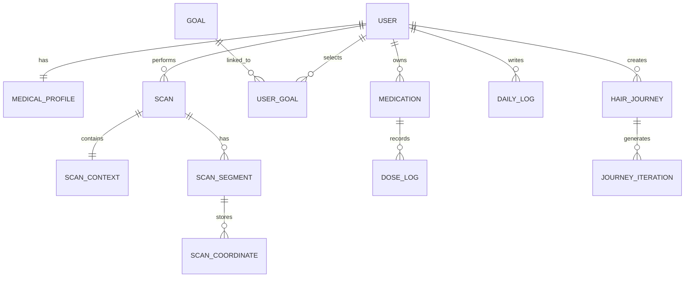

# Scalpify — Final Year Project Report

> AI-Powered Hair-Loss Analysis & Hair-Transplant Recovery Tracking System

**Department of Computer Science**
**Forman Christian College (A Chartered University), Lahore, Pakistan**

Submitted in partial fulfillment of the requirements for the degree of
**Bachelor of Science in Computer Science (Honors)**

| | |
|---|---|
| **Project Title** | Scalpify — AI-Powered Hair-Loss Analysis & Recovery Tracking |
| **Primary Advisor** | `<fill in>` |
| **Secondary Advisor** | `<fill in>` |
| **Group Members (Reg# — Name)** | `<fill in>` |
| **Submission Date** | `<fill in>` |

---

## Table of Contents

- [Abstract](#abstract)
- [Acknowledgement](#acknowledgement)
- [1. Introduction](#1-introduction)
- [2. Requirements Analysis](#2-requirements-analysis)
- [3. System Design](#3-system-design)
- [4. Test Specification and Results](#4-test-specification-and-results)
- [5. Conclusion and Future Work](#5-conclusion-and-future-work)
- [6. References](#6-references)
- [7. Glossary](#7-glossary)
- [8. Deployment / Installation Guide](#8-deployment--installation-guide)
- [9. User Manual](#9-user-manual)

> **Figures** referenced in this report live in [`/diagrams`](diagrams): `fig1_use_case.png`, `fig2_architecture.png`, `fig3_erd.png` (corrected ERD), `fig4_class.png`, `fig5_components.png`, `fig6_sequence.png`, `fig7_activity.png`, `fig8_state.png`. Insert screenshots where indicated in Section 3.6.2.

---

# Abstract

Androgenetic alopecia and the growing demand for hair-transplant surgery have created a need for accessible tools that help individuals understand the severity of their hair loss, track post-operative recovery, and form realistic expectations of outcomes, yet most existing solutions are either clinically inaccessible or limited to superficial cosmetic filters. This report presents Scalpify, an AI-powered hair-loss analysis and hair-transplant recovery tracking system comprising a React Native/Expo mobile application and a FastAPI backend. The system addresses the problem of fragmented, non-quantitative self-assessment by combining a YOLOv11 instance-segmentation model that quantifies baldness ratio, hair coverage, real-world area (cm²), and an indicative Norwood classification from a single scalp photograph, with a Replicate-driven (google/nano-banana-pro) multi-stage hair-journey visualization that simulates a six-stage post-FUE recovery timeline. A context-aware OpenAI (GPT-4o-mini) assistant grounds its responses in the user's own scan and medication data, while device-local stores provide medication-reminder scheduling, adherence tracking, and a structured 180-day recovery calendar. The implemented prototype successfully delivers end-to-end scalp analysis, identity-anchored recovery previews, medication adherence tracking with notifications, and an interactive before/after segmentation overlay, with optional Supabase persistence. We conclude that an integrated mobile-plus-AI pipeline can make quantitative scalp assessment and recovery guidance meaningfully more accessible, while noting that the segmentation model is crown-optimized and the Norwood mapping and area estimates are indicative rather than diagnostic.

# Acknowledgement

We would like to express our sincere gratitude to our supervisor, `<fill in supervisor name>`, for their invaluable guidance, encouragement, and continuous support throughout the course of this Final Year Project. We are also thankful to the faculty and staff of `<fill in department/university name>` for providing the resources and academic environment that made this work possible. Finally, we extend our heartfelt appreciation to our families and friends for their patience and unwavering support during the development of Scalpify.

# 1. Introduction

## 1.1 Introduction

Hair loss, and androgenetic alopecia in particular, is one of the most common dermatological concerns worldwide, affecting a substantial proportion of both men and women over the course of their lives. Beyond its physiological dimension, hair loss carries a significant psychological and social burden, frequently influencing self-image, confidence, and overall well-being. In parallel, hair-transplant surgery—most notably Follicular Unit Extraction (FUE)—has become an increasingly popular intervention, yet the recovery process spans many months and is characterized by counter-intuitive phases such as early "shock loss" before visible regrowth begins. Individuals navigating either condition are commonly left without accessible, quantitative tools to assess the severity of their hair loss, to set realistic expectations for surgical outcomes, or to remain consistent with the medication regimens that underpin successful treatment.

Scalpify is an AI-powered hair-loss analysis and hair-transplant recovery tracking system designed to address these gaps within a single, self-contained mobile experience. The system is composed of a cross-platform mobile application built with React Native and Expo, and a Python FastAPI backend that hosts the artificial-intelligence capabilities. At the core of the analysis pipeline is a YOLOv11 instance-segmentation model that, from a single scalp photograph, segments hair-bearing and bald regions and computes a set of quantitative measurements including baldness ratio, hair coverage, real-world area in square centimetres, and an indicative Norwood scale classification with associated severity grading. To help users form realistic expectations of surgical results, Scalpify integrates a Replicate-hosted image-editing model (`google/nano-banana-pro`) that generates an identity-anchored, six-stage post-FUE recovery visualization spanning fifteen days to eight months. Complementing these visual features, an OpenAI GPT-4o-mini assistant provides conversational guidance that is grounded in the user's own scan results, medical profile, and medication adherence, while device-local stores manage medication reminders, adherence streaks, daily recovery logs, and a structured 180-day recovery calendar with phase and milestone tracking.

A defining characteristic of the current implementation is its privacy-conscious, device-local data model: user accounts, scan history, medication logs, daily recovery entries, and chat history are persisted on the device using AsyncStorage, with Supabase persistence and storage available as an optional backend. The system architecture, screen flow, data entities, and key interactions are documented in the accompanying diagrams—`fig1_use_case.png` (the actors and use cases the system supports), `fig2_architecture.png` (the high-level mobile-plus-backend architecture and external AI integrations), `fig3_erd.png` (the entity-relationship model covering users, scans, medications, and logs), `fig4_class.png` (the class structure of the application stores and services), `fig5_components.png` (the component breakdown of screens, stores, and backend services), `fig6_sequence.png` (the end-to-end sequence of a scan-and-analyze interaction), `fig7_activity.png` (the branched onboarding and analysis activity flow), and `fig8_state.png` (the application and recovery-tracking state transitions). Together, these elements form an integrated pipeline that brings quantitative scalp assessment, AI-assisted outcome visualization, and recovery support into an accessible mobile format.

## 1.2 Objectives

The primary objectives of the Scalpify project are as follows:

1. **To provide quantitative scalp analysis from a single photograph.** Design and implement an AI pipeline, built on a YOLOv11 instance-segmentation model, that segments hair and bald regions and computes objective measurements—baldness ratio, hair coverage percentage, real-world area in square centimetres and square inches, an indicative Norwood scale classification, severity grading, and per-class confidence scores.

2. **To deliver an accessible cross-platform mobile application.** Develop a React Native/Expo application that enables users to capture scalp photographs, view their latest and historical scan results, and interact with an interactive before/after segmentation overlay that visually distinguishes hair and bald regions.

3. **To generate realistic, identity-preserving recovery visualizations.** Integrate a Replicate-hosted image-editing model (`google/nano-banana-pro`) to produce a chained, six-stage post-FUE recovery timeline (fifteen days through eight months) that anchors the user's identity, hairline, and framing across stages while progressively simulating regrowth.

4. **To support post-transplant recovery and medication adherence.** Provide a 180-day recovery calendar with defined healing phases and milestones, daily symptom and note logging, medication management with locally scheduled reminders via `expo-notifications`, and adherence tracking including completion rings and streaks.

5. **To offer context-aware conversational guidance.** Implement an OpenAI GPT-4o-mini assistant whose responses are scoped to hair loss, transplants, and treatments, and grounded in the user's own scan results, medical profile, and adherence data, with appropriate non-diagnostic disclaimers.

6. **To preserve user privacy through a device-local data model.** Ensure that user accounts, scans, medication logs, recovery entries, and chat history are stored locally on the device by default, with data cleared on sign-up and sign-out to prevent cross-account leakage, while supporting optional Supabase persistence and storage.

## 1.3 Problem Statement

Despite the high prevalence of hair loss and the rising popularity of hair-transplant surgery, individuals affected by these conditions lack accessible, integrated tools to support self-assessment and recovery. Several specific problems motivate this project:

- **Lack of quantitative self-assessment.** Most consumer-facing tools rely on subjective visual comparison or generic questionnaires. There is no readily accessible way for a non-clinical user to obtain objective measurements—such as baldness ratio, coverage percentage, or affected scalp area—from a simple photograph, nor an indicative severity classification to contextualize their condition.

- **Unrealistic expectations of transplant outcomes.** Hair-transplant recovery unfolds over many months and includes a counter-intuitive early shedding ("shock loss") phase. Without a credible, personalized visualization of the recovery trajectory, prospective and post-operative patients struggle to form realistic expectations, which can lead to anxiety or premature dissatisfaction.

- **Fragmented recovery and treatment support.** Recovery guidance, medication reminders, adherence tracking, and educational information are typically scattered across separate applications or absent altogether. Inconsistent medication adherence in particular is a well-known factor that undermines treatment effectiveness, yet existing solutions rarely combine reminders, adherence metrics, and personalized guidance in one place.

- **Generic, ungrounded information sources.** General-purpose search engines and chatbots provide information that is not grounded in the user's actual condition, scan history, or medication regimen, limiting their usefulness for personalized decision-making.

- **Privacy concerns around sensitive health imagery.** Scalp photographs and medical profiles are sensitive personal data, and many users are reluctant to entrust such information to cloud services by default.

Scalpify addresses these problems by unifying quantitative AI-based scalp analysis, identity-preserving recovery visualization, integrated medication and recovery tracking, and context-grounded conversational guidance within a single, privacy-conscious, device-local mobile application.

## 1.4 Scope

The scope of the Scalpify project encompasses the design, implementation, and integration of a mobile application and an AI backend with the following boundaries:

**In Scope:**

- A cross-platform mobile application (React Native 0.81.5, React 19.1.0, Expo ~54) comprising authentication, a branched post-signup onboarding questionnaire, a tab-based main interface (Home, Scan, Track, Profile), and a total of twenty-seven screens.
- Scalp photo capture via `expo-camera` and image-picker selection, with on-device image preprocessing.
- A FastAPI backend exposing endpoints for analysis, hair-journey generation, chat, facial recognition, health checks, and history retrieval, built around a YOLOv11 segmentation model.
- Quantitative analysis output including baldness ratio, hair coverage, area in pixels, cm², and in², indicative Norwood classification, severity grading, hair-health scoring, confidence scores, and boundary coordinates, together with an interactive before/after segmentation overlay.
- A chained six-stage post-FUE hair-journey visualization generated via the Replicate `google/nano-banana-pro` model, with YOLO-driven region grounding and identity anchoring.
- A context-aware OpenAI GPT-4o-mini chat assistant grounded in user data.
- Post-transplant support features: a 180-day recovery calendar with phases and milestones, daily symptom/note logging, medication management, locally scheduled reminders, and adherence tracking (rings and streaks).
- A device-local persistence model using AsyncStorage, with optional Supabase database and storage integration when configured.

**Out of Scope:**

- Clinical-grade or diagnostic certification. The Norwood mapping, severity thresholds, and pixel-to-real-world area conversions are heuristic and indicative rather than clinically validated, and the system explicitly does not provide medical diagnosis or advice.
- Robust, production-grade authentication. The current implementation uses email-based, device-local identification without password hashing, session tokens, or real backend authentication.
- Reliable frontal and hairline analysis. The primary segmentation model (`best.pt`) is crown/vertex-optimized; frontal and anterior hairline detection are known to be unreliable and are not within the guaranteed scope.
- Camera-calibrated, absolute measurement. Real-world area estimates assume an average head width and no depth calibration, and are therefore subject to variance depending on photo angle and actual head size.
- Multi-user backend synchronization and cross-device account portability, which are not implemented in the device-local data model.

---

The diagram files exist. Here is the complete chapter.

# 2. Requirements Analysis

This chapter establishes the problem domain and the requirements that drive the design of Scalpify. It begins with a focused review of the relevant clinical and technical literature, identifies the user classes the system serves, enumerates the constraints and assumptions under which the system operates, and finally specifies the functional and nonfunctional requirements. Functional requirements are expressed as use-cases and summarised in the use-case diagram referenced in Section 2.6.

## 2.1 Literature Review

Androgenetic alopecia (pattern hair loss) is the most common form of progressive hair loss in both men and women. In clinical practice its severity is most frequently described using the **Hamilton–Norwood scale**, an ordinal classification (commonly rendered as stages I through VII, with intermediate variants such as III-A and IV-A) that characterises the typical recession of the frontal hairline and the thinning of the vertex/crown region. The scale is widely used because it offers a shared vocabulary between clinicians and patients, but it is inherently a qualitative, visual judgement: two clinicians may assign adjacent stages to the same scalp, and the scale does not directly quantify the surface area or density of hair loss. This motivates a complementary, measurement-based approach in which an image is analysed to produce a reproducible numeric estimate of bald versus hair-bearing area, alongside an indicative Norwood label.

A second relevant clinical domain is **hair-transplant recovery**, in particular the Follicular Unit Extraction (FUE) and Follicular Unit Transplantation (FUT) techniques. Post-operative regrowth follows a well-known, multi-month trajectory: an initial healing phase, a period of "shock loss" in which transplanted hairs shed, and then a gradual regrowth and maturation phase that typically extends over roughly six months or more before the final result settles. Patients frequently find the shedding phase distressing because visible progress lags behind the procedure by several weeks. Tools that set realistic expectations and that help patients log day-to-day sensations and adherence to post-operative care therefore have clear value, both for reassurance and for treatment compliance.

On the technical side, **computer-vision (CV) segmentation** has matured substantially. Modern instance-segmentation architectures such as the YOLO family produce per-pixel masks in near real time and can be trained to distinguish "hair" from "bald scalp" as discrete classes. Once such masks are available, derived quantities — the ratio of bald pixels to total scalp pixels, an estimated real-world area in cm², and an indicative severity band — can be computed deterministically. Separately, recent **generative image-editing models** (accessed in this project via the Replicate platform) make it feasible to synthesise plausible "future" appearances of a scalp, which can be chained across several stages to depict a recovery timeline.

Existing consumer applications partially address these needs. A number of commercial apps offer self-assessment of hair loss, photo-based "hairline" tracking, or before/after comparison galleries, and several clinics provide proprietary progress-tracking portals. However, these tools tend to address only one part of the journey: assessment tools rarely integrate recovery tracking, recovery trackers rarely provide quantitative segmentation-based measurement, and very few combine an explainable measurement pipeline, a generative recovery preview, structured medication/adherence tracking, and a data-grounded conversational assistant within a single mobile experience.

**The gap Scalpify fills.** Scalpify integrates these capabilities into one React Native/Expo application backed by a FastAPI service. It provides (a) a YOLOv11 segmentation pipeline that converts a scalp photograph into reproducible measurements (baldness ratio, hair coverage, estimated area, and an indicative Norwood band), (b) an AI-generated multi-stage recovery preview, (c) post-transplant recovery tracking with a phased calendar and daily logs, (d) medication reminders and adherence analytics, and (e) an OpenAI-backed assistant grounded in the user's own scan, medication, and recovery data. It is important to state the scope honestly: the Norwood label produced by the system is informational rather than diagnostic, the area conversion is an estimate based on an assumed average head width, and the segmentation model is most reliable on crown/vertex views. These limitations are discussed further in Sections 2.3 and 2.7.2.

## 2.2 User Classes and Characteristics

Scalpify is designed for two primary user classes, with a shared onboarding path that branches according to whether the user has already undergone a hair transplant. The branching is implemented in the post-signup questionnaire (the `treatmentDone` field selects the branch).

**Class A — Pre-treatment / assessing users.** These users have not had a transplant and are using the app to understand and monitor their hair loss, or to inform a decision about treatment. During onboarding they complete the "not-done" branch, declaring their goals (`understand`, `track`, `visualize`, `severity`, `decide`) and their treatment intent (`have`, `planning`, `deciding`, `none`). Their core activities are capturing scalp scans, reading the resulting report (baldness percentage, hair coverage, indicative Norwood band, and clinician-style note), comparing scans over time, optionally generating an AI recovery preview to visualise a possible outcome, and asking the assistant questions grounded in their data. These users value clarity and reassurance and are typically not clinically trained; the interface must therefore make measurements understandable without implying a medical diagnosis.

**Class B — Post-transplant users tracking recovery.** These users have a recorded `surgeryDate` and complete the "done" branch of onboarding, providing their surgery technique (FUE/FUT/none), graft count, scalp-care routine, and past adherence history. Their core activities centre on the Recovery Calendar: a 180-day phased timeline (Initial Healing, Shedding Normal, Growth Spurt, Active Regrowth) with milestones at days 7, 14, 28, 60, 90, 120 and 180, supported by daily logs capturing sensation (`normal`/`itchy`/`tender`) and free-text notes, plus rotating daily care tips. They also rely heavily on medication management and adherence tracking to maintain a post-operative regimen, and on periodic scans to observe density change over time.

**Common characteristics.** Both classes share the questionnaire's common path (treatment answer, age, sex, age of onset, ethnicity and family history) and a reminders permission soft-prompt at the end. All users interact through a mobile device with a camera, operate on device-local data only (there is currently no per-user backend account), and benefit from the same assistant, scan and medication features. A secondary, implicit actor is the **system administrator / developer** who operates the FastAPI backend and configures external service credentials (OpenAI, Replicate, Supabase, AWS); this actor does not use the mobile UI but is responsible for the availability of the server-side capabilities.

## 2.3 Design and Implementation Constraints

- **Platform and framework.** The client is constrained to the React Native 0.81.5 / React 19.1.0 / Expo ~54 stack with TypeScript ~5.9.2. Navigation uses React Navigation v7 (native-stack and bottom-tabs). UI rendering relies on `react-native-svg`, `react-native-gesture-handler` and `expo-linear-gradient`.
- **Local-only persistence.** All user-scoped data (user profile, scans, medications, dose logs, daily logs, chat history) is stored device-locally through AsyncStorage using a `useSyncExternalStore` pattern. There is no per-user cloud account, no password hashing and no session token; "authentication" is email-based matching only. Consequently, data does not synchronise across devices, and storage is capped (scans max 60 entries, chat max 100 messages).
- **Backend model dependency and accuracy.** The segmentation pipeline depends on a YOLOv11 model (`best.pt`) trained primarily on crown/vertex views. Frontal and hairline views are therefore unreliable, and the indicative Norwood mapping uses heuristic baldness-ratio thresholds that are not clinically validated.
- **Estimated physical measurement.** Conversion from pixels to cm²/inch² assumes an average head width of 15 cm with an elliptical-shape factor, without camera calibration or depth. Absolute area values are estimates (the documentation notes variance on the order of ±20%) and are most accurate for standardised, top-down photos.
- **Image input gating.** The backend enforces image constraints: allowed types JPG/PNG/BMP, maximum 10 MB, minimum 224×224 and maximum 4096×4096 pixels, plus a quality gate (brightness, contrast and Laplacian sharpness) that may reject otherwise valid photos under non-standard lighting.
- **External-service rate limits and latency.** Hair-journey generation is bounded by Replicate rate limits (~6 requests/minute on low-credit accounts), enforced via an 11-second inter-stage throttle and exponential backoff; the client therefore allows a 10-minute timeout. Chat and analysis calls have 60 s and 90 s client timeouts respectively.
- **Notifications require a development/standalone build.** `expo-notifications` scheduling (daily med reminders, snooze, category actions) requires a native build rather than a bare managed runtime; notification behaviour and Android channels (HIGH importance, vibration pattern) are platform-specific.
- **Development connectivity.** In development, the mobile device and the FastAPI server must share a LAN, and relative `/journey-files` image URLs are absolutised to a reachable host so the device can fetch generated images.
- **Optional/conditional backends.** Supabase persistence and storage are only active when `SUPABASE_URL`, `SUPABASE_ANON_KEY` and `SUPABASE_SERVICE_KEY` are all set; otherwise the backend falls back to mock responses and local `/journey-files` serving.

## 2.4 Assumptions and Dependencies

- **OpenAI (chat assistant).** The chat feature depends on the OpenAI Chat Completions API (`gpt-4o-mini`, temperature 0.5, max 600 tokens). It is assumed that a valid `OPENAI_API_KEY` is configured; if absent, the `/chat` endpoint is disabled and returns HTTP 503.
- **Replicate (recovery preview).** The hair-journey feature depends on Replicate's `google/nano-banana-pro` image-editing model and a valid `REPLICATE_API_TOKEN`. It is assumed the account has sufficient credit; rate limiting and a fallback model are handled internally, and the feature is disabled (HTTP 503) if the token is missing.
- **Supabase (optional persistence/storage).** It is assumed that, where cloud persistence is desired, the three Supabase keys are configured and the storage buckets (`uploads`, `processed`, `hair-journey`) have appropriate public policies. Without these, the system runs in a dev fallback mode with mock URLs and local file serving.
- **AWS Rekognition (facial recognition).** The optional facial-recognition endpoint depends on `boto3` and valid AWS credentials (`AWS_ACCESS_KEY_ID`, `AWS_SECRET_ACCESS_KEY`, region). Unlike chat and journey, this service raises an exception rather than gracefully disabling when credentials are missing.
- **Device camera and media access.** It is assumed the device provides a working camera (via `expo-camera`) and that the user grants camera and photo-library permissions; scans cannot be captured otherwise.
- **Notification permissions and build type.** It is assumed the app runs in a development/standalone build capable of scheduling notifications, and that the user grants notification permission when enabling a reminder toggle.
- **LAN connectivity in development.** It is assumed that, during development, the device and backend are on the same network so that `/analyze`, `/chat`, `/hair-journey/generate` and generated image URLs are reachable.
- **YOLO model availability.** It is assumed the trained model file (`best.pt`) is present at the configured `MODEL_PATH`; the analysis service raises an error if it is missing.
- **User-provided photo quality.** It is assumed users will provide reasonably lit, in-focus, crown-oriented scalp photos; measurement reliability degrades for frontal/hairline views and poor-quality images.

## 2.5 Functional Requirements

The functional requirements are expressed below as use-cases. Each use-case is grounded in implemented behaviour of the Scalpify client and FastAPI backend.

### UC-1: Sign Up & Onboarding

| Field | Description |
|---|---|
| **Use-Case Name** | Sign Up & Onboarding |
| **Actor** | New user (Pre-treatment or Post-transplant) |
| **Preconditions** | App installed and launched; user is not signed in. |
| **Main Flow** | 1. User opens the Welcome screen and selects Sign Up. 2. User enters full name and email on SignUpScreen. 3. System generates a new user ID and clears any device-local data via `clearUserScopedData()` to prevent cross-account leakage. 4. System presents the branched onboarding questionnaire, computed by `onboardingFlow.ts`. 5. User completes the shared path (treatment answer, age, sex, onset age, ethnicity, family history). 6. Based on `treatmentDone`, the system routes to the "done" branch (surgery details, routine, adherence) or the "not-done" branch (goals, treatment intent). 7. User completes the reminders permission soft-prompt. 8. System persists answers into `userStore.medical` via `updateMedical()`. |
| **Alternate Flow** | A1: User selects Sign In instead and authenticates by email match (UC unrelated). A2: User edits a single field later from Profile; the corresponding onboarding screen opens with `edit: true` and saves only that field. |
| **Postconditions** | A user profile and medical profile exist in `scalpify.user.v1`; the user lands on the main tab navigator. |

### UC-2: Capture & Analyze Scalp Scan

| Field | Description |
|---|---|
| **Use-Case Name** | Capture & Analyze Scalp Scan |
| **Actor** | Signed-in user |
| **Preconditions** | User signed in; camera permission granted; backend reachable. |
| **Main Flow** | 1. User opens CameraScreen and captures a scalp photo via `expo-camera`. 2. Client converts the image to JPEG, max 1600px, 92% quality. 3. Client POSTs the image with `user_id` to `/api/v1/analyze` (90 s timeout). 4. Backend validates the image (type/size/dimensions and a brightness/contrast/sharpness quality gate), standardises to 512×512, and runs YOLOv11 segmentation. 5. Backend computes measurements (baldness %, hair coverage %, area in cm²), an indicative Norwood band, severity and confidence, and returns the result. 6. Client stores the result as a `ScanRecord` (capped at 60) in `scalpify.scans.v1`. |
| **Alternate Flow** | A1: Image fails validation/quality gate → backend returns an error and the client prompts the user to retake. A2: Network/timeout error → client surfaces a retry prompt; no record is stored. A3: Backend Supabase disabled → analysis still succeeds; cloud upload returns dev mock URLs. |
| **Postconditions** | A new scan is persisted locally and becomes the latest scan shown on ScanResultsScreen. |

### UC-3: View Scan Report

| Field | Description |
|---|---|
| **Use-Case Name** | View Scan Report |
| **Actor** | Signed-in user |
| **Preconditions** | At least one scan exists in `scanStore`. |
| **Main Flow** | 1. User opens the Scan tab (ScanResultsScreen). 2. System displays the latest scan's measurements (baldness %, coverage %, area cm²), classification (severity badge, Norwood band) and a dynamic clinician-style note based on severity and Norwood. 3. System renders the before/after overlay (BeforeAfterScalp) with a drag-to-wipe divider comparing the original photo against the AI segmentation overlay (hair tinted, bald/thinning outlined). 4. User can open the dedicated NorwoodAnalysisScreen for the Norwood visualisation. 5. User can scroll the scan-history timeline. |
| **Alternate Flow** | A1: No scans exist → system shows an empty state prompting the user to capture a scan (UC-2). A2: Boundary coordinates absent → overlay falls back to displaying the photo without polygons. |
| **Postconditions** | The user has viewed the interpreted report; no state change. |

### UC-4: Generate AI Recovery Preview

| Field | Description |
|---|---|
| **Use-Case Name** | Generate AI Recovery Preview |
| **Actor** | Signed-in user |
| **Preconditions** | At least one scan with a photo exists; backend reachable; `REPLICATE_API_TOKEN` configured. |
| **Main Flow** | 1. User taps "Generate Journey" on ScanResultsScreen and selects an iteration count (5/10/15/20). 2. Client POSTs the latest scan photo to `/api/v1/hair-journey/generate` (10-minute timeout). 3. Backend grounds the bald region via YOLO, then chains multi-stage edits through `google/nano-banana-pro` (15d → 1mo → 3mo → 4mo → 6mo → 8mo post-FUE), passing the original as an identity anchor on chained stages, with throttling and backoff. 4. Backend returns the original image URL, final result URL and per-iteration images with timings. 5. JourneyScreen displays a side-by-side progression and a real density delta (newest minus oldest coverage %). |
| **Alternate Flow** | A1: Replicate rate-limited (HTTP 429) → backend retries with exponential backoff; if still failing, generation reports failure. A2: Token missing → endpoint returns HTTP 503 and the client shows the feature as unavailable. A3: Supabase disabled → images served locally via absolutised `/journey-files` URLs. |
| **Postconditions** | A recovery-preview session is generated and displayed; if Supabase is enabled, a `hair_journey_sessions` record is stored. |

### UC-5: Manage Medications & Reminders

| Field | Description |
|---|---|
| **Use-Case Name** | Manage Medications & Reminders |
| **Actor** | Signed-in user |
| **Preconditions** | User signed in; for reminders, app runs in a build capable of scheduling notifications. |
| **Main Flow** | 1. User opens the Track tab (MedsScreen) and adds a medication (name, type, time HH:MM); the system auto-assigns an icon and colours. 2. User enables the daily reminder toggle. 3. System requests notification permission if needed (`ensureNotificationPermission`). 4. System schedules a DAILY notification at the med time via `expo-notifications` (category `MED_REMINDER`, Android channel `med-reminders`, HIGH importance) and stores the returned `notificationId`. 5. User may edit or remove a med; on removal/toggle-off the scheduled notification is cancelled. |
| **Alternate Flow** | A1: Permission denied → reminder is not scheduled; med is still saved without notifications. A2: User taps "Test reminder" → a one-off notification fires ~5 s later. A3: From a notification action the user selects "Snooze 15m" → a one-off reminder is rescheduled N minutes later. |
| **Postconditions** | Medication list and reminder schedule are persisted in `scalpify.meds.v1` and associated keys. |

### UC-6: Track Adherence

| Field | Description |
|---|---|
| **Use-Case Name** | Track Adherence |
| **Actor** | Signed-in user |
| **Preconditions** | At least one medication exists in `medsStore`. |
| **Main Flow** | 1. On MedsScreen the user marks a dose as taken ("Taken ✓"). 2. System records the completion key `${medId}|YYYY-MM-DD` in the done set and the exact timestamp in `doneTimes`, and updates `lastMarkedAt`. 3. System recomputes today's adherence ring (doses done / doses due) via `adherencePctForDate`. 4. System recomputes the adherence streak (consecutive days with ≥1 dose, capped at 60) via `adherenceStreak`. 5. System displays a timestamped dose log (`getMedLog`, newest first, limit 60) and a "Last logged: Xm ago" indicator. |
| **Alternate Flow** | A1: User edits a dose time via `editDoseTime`; if shifted across midnight the dose moves to a different calendar day, and adherence metrics recompute. A2: No doses marked today → adherence ring shows 0% and streak may reset. |
| **Postconditions** | Dose completion and timing are persisted; adherence metrics reflect the latest action. |

### UC-7: Chat with Assistant

| Field | Description |
|---|---|
| **Use-Case Name** | Chat with Assistant |
| **Actor** | Signed-in user |
| **Preconditions** | User signed in; backend reachable; `OPENAI_API_KEY` configured. |
| **Main Flow** | 1. User opens ChatScreen and types a question or taps a suggestion pill. 2. Client builds a context snapshot (`buildContext`): first name, age, sex, treatment status / recovery day / phase, latest scan (severity, Norwood, baldness %, coverage %), medications and adherence %. 3. Client POSTs the message history plus context to `/api/v1/chat` (60 s timeout). 4. Backend composes the scoped system prompt, caps history to the last 20 turns, and calls `gpt-4o-mini`. 5. Backend returns the reply and model name. 6. Client appends both turns to `chatStore` (capped at 100 messages, gray user / blue assistant bubbles). |
| **Alternate Flow** | A1: `OPENAI_API_KEY` missing → endpoint returns HTTP 503; client shows the assistant as unavailable. A2: User taps "Clear history" → `clearChat` empties the conversation. A3: Context fields absent → assistant proceeds with whatever data is available. |
| **Postconditions** | The exchange is persisted locally in `scalpify.chat.v1`. |

### UC-8: Track Post-Transplant Recovery

| Field | Description |
|---|---|
| **Use-Case Name** | Track Post-Transplant Recovery |
| **Actor** | Post-transplant user |
| **Preconditions** | User has a recorded `surgeryDate`. |
| **Main Flow** | 1. User opens RecoveryCalendarScreen. 2. System computes the 180-day timeline and current phase (Initial Healing 1–14, Shedding Normal 15–90, Growth Spurt 91–120, Active Regrowth 121–180) and renders milestones at days 7, 14, 28, 60, 90, 120, 180. 3. System shows a daily-rotating care tip (7 tips). 4. User records a daily entry: sensation (`normal`/`itchy`/`tender`) and free-text notes. 5. System persists the entry keyed by `YYYY-MM-DD` via `saveEntry` and highlights days with saved entries on the calendar. |
| **Alternate Flow** | A1: No `surgeryDate` set → the recovery calendar is not applicable and is not surfaced. A2: User revisits a past day → existing entry is loaded via `getEntry` for editing. |
| **Postconditions** | Daily recovery entries are persisted in `scalpify.dailyLog.v1`. |

## 2.6 Use Case Diagram

The overall functional scope is summarised in the use-case diagram, **`/diagrams/fig1_use_case.png`**. The diagram depicts the two principal human actors — the *Pre-treatment / Assessing User* and the *Post-transplant User* — on the left, with a secondary *System Administrator / Developer* actor (responsible for backend and external-credential configuration) shown separately. The central Scalpify system boundary encloses the primary use-cases described in Section 2.5: **Sign Up & Onboarding**, **Capture & Analyze Scalp Scan**, **View Scan Report**, **Generate AI Recovery Preview**, **Manage Medications & Reminders**, **Track Adherence**, **Chat with Assistant**, and **Track Post-Transplant Recovery**. Associations connect each actor to the use-cases relevant to its class: both user classes share scanning, reporting, recovery preview, medication management, adherence tracking and chat, while *Track Post-Transplant Recovery* associates specifically with the post-transplant user. The diagram also indicates the dependency on external services (OpenAI for chat, Replicate for the recovery preview, and the YOLOv11 model for analysis) reached through the backend, conveying which capabilities require server-side availability.

## 2.7 Nonfunctional Requirements

### 2.7.1 Performance Requirements

- **Scan analysis latency.** A single `/analyze` request should complete well within its 90-second client timeout; images are downscaled client-side (max 1600px, 92% JPEG) and standardised server-side to 512×512 to bound processing cost. The backend runs the YOLOv11 model on CPU by default (`DEVICE="cpu"`, configurable to CUDA).
- **Recovery-preview latency.** Multi-stage generation is bounded by Replicate rate limits; the design budgets up to 10 minutes (approximately eight stages at ~13 s each plus retries) and enforces an 11-second inter-stage throttle to avoid 429 errors.
- **Chat responsiveness.** Chat replies are capped at 600 tokens with history trimmed to the last 20 turns, supporting responses within the 60-second client timeout.
- **UI smoothness.** Interactive elements such as the before/after drag-to-wipe divider use `Animated.Value` to avoid re-renders during gestures, preserving smooth interaction.
- **Local data bounds.** Stores are capped (scans ≤ 60, chat ≤ 100, dose log display ≤ 60) to keep AsyncStorage reads/writes and rendering inexpensive on-device.
- **Request observability.** The backend attaches `X-Process-Time` and `X-Request-ID` headers to every response, enabling latency measurement during evaluation.

### 2.7.2 Safety Requirements

- **Non-diagnostic framing.** The Norwood label and severity bands are explicitly informational, derived from heuristic baldness-ratio thresholds that are not clinically validated; the system must not present outputs as medical diagnosis.
- **Assistant disclaimers and scoping.** The chat system prompt scopes responses to hair-loss/recovery topics, grounds answers in the user's own data, treats medication information as educational only, and includes a "not a doctor" disclaimer, steering off-topic requests back in scope.
- **Measurement caveats.** Area estimates rely on an assumed 15 cm head width without calibration, with documented variance on the order of ±20%; reliability is degraded for frontal/hairline views, which the design should communicate to users.
- **Input quality gating.** The backend rejects images that are too dark/overexposed, low-contrast or blurry to avoid producing misleading measurements from poor inputs.
- **Generative-content honesty.** The recovery preview is a synthesised, illustrative projection (with a known risk of identity drift on later stages); it must be presented as a visualisation, not a guaranteed outcome.

### 2.7.3 Security Requirements

- **Data locality and isolation.** All user-scoped data is stored device-locally; sign-up and sign-out both invoke `clearUserScopedData()` to wipe scans, medications, logs and chat, preventing cross-account data leakage on a shared device.
- **Authentication limitations (acknowledged).** The current implementation uses email-based identification without password hashing, session tokens or backend authentication. This is a known limitation and a candidate for future hardening.
- **Backend transport and access control.** CORS and trusted-host policies are configurable; trusted-host enforcement is applied in production (`DEBUG=False`). Production deployments must replace the permissive default `*` origins/hosts with explicit allow-lists.
- **Credential handling.** External-service secrets (OpenAI, Replicate, Supabase service key, AWS) are read from environment/`.env` and never embedded in the client; the Supabase service key is used only server-side for storage uploads.
- **Graceful degradation on missing credentials.** Chat and hair-journey endpoints return HTTP 503 when their keys are absent rather than failing unsafely, and Supabase persistence falls back to local dev mode without exposing secrets.
- **Input validation.** The backend validates file type, size and dimensions and applies Pydantic request validation (HTTP 422 on malformed requests), reducing the attack surface from malformed uploads.

### 2.7.4 Additional Software Quality Attributes

- **Maintainability.** The client follows a consistent store pattern (`useSyncExternalStore` + AsyncStorage) with one store per concern (user, scans, meds, daily log, chat), and the backend separates concerns into discrete services (AnalysisService, HairJourneyService, ChatService, FacialRecognitionService), easing modification and testing.
- **Portability / cross-platform.** Built on Expo/React Native, the client targets both iOS and Android from a single codebase; the backend is a standard FastAPI/Uvicorn service.
- **Reliability / robustness.** Client timeouts, server retries with exponential backoff, and dev fallbacks (mock Supabase responses, local `/journey-files` serving) allow the system to degrade gracefully under partial failure.
- **Usability.** A consistent dark "clinical" theme (`theme.ts`), a four-tab primary navigation, suggestion pills in chat, and an empty-state-aware report screen support discoverability for non-technical users.
- **Observability.** Per-request timing and request IDs, plus startup/shutdown lifespan logging and health/readiness/liveness endpoints, support monitoring and diagnosis.
- **Scalability (server-side path).** Optional Supabase persistence and storage buckets provide a path from device-local data toward shared, multi-device storage without altering the client's measurement contract.

## 2.8 Other Requirements

- **Health and operability endpoints.** The backend exposes `/health` (database, storage, model status), `/model/info`, `/ping`, and Kubernetes-style `/ready` and `/live` probes to support deployment and monitoring.
- **Configuration management.** Behaviour is governed by settings (`app/core/config.py`) covering model path and thresholds (`CONFIDENCE_THRESHOLD=0.4`, `IOU_THRESHOLD=0.4`), file constraints, storage buckets, rate limits, and optional service credentials, read from a parent `.env` file.
- **Rate limiting.** The backend defines request-rate parameters (`RATE_LIMIT_REQUESTS=10`/`RATE_LIMIT_WINDOW=60s`, `RATE_LIMIT_PER_MINUTE=30`, `MAX_CONCURRENT_REQUESTS=5`) to protect server resources and downstream APIs.
- **Internationalisation and accessibility (future scope).** The current build is English-only with a fixed dark theme; broader localisation and accessibility conformance are noted as future requirements rather than implemented features.
- **Data retention.** Cloud-stored files (when Supabase is enabled) carry a configurable expiry (`FILE_EXPIRY_HOURS=24`); device-local data persists until the user signs out or signs up again.
- **Optional facial-recognition capability.** An AWS Rekognition-backed facial-recognition endpoint exists in the backend (face count, bounding boxes, 37 landmarks, attributes) and is available for future client integration; unlike chat and journey, it requires AWS credentials to operate and does not silently disable.
- **Supporting design artefacts.** Beyond the use-case diagram (`/diagrams/fig1_use_case.png`), the design is documented by the architecture diagram (`fig2_architecture.png`), the entity-relationship diagram (`fig3_erd.png`), the class diagram (`fig4_class.png`), the component diagram (`fig5_components.png`), a sequence diagram (`fig6_sequence.png`), an activity diagram (`fig7_activity.png`) and a state diagram (`fig8_state.png`), all located in `/diagrams`; these are referenced in the System Design chapter.

---

*Personal and administrative details to be completed by the author:* Student name(s): `<fill in>`; Registration number(s): `<fill in>`; Supervisor/Advisor: `<fill in>`; Department/Institution: `<fill in>`; Submission date: `<fill in>`.

---

All diagrams confirmed. Here is the System Design chapter.

# 3. System Design

This chapter presents the design of the Scalpify system. It describes the layered application and data architecture, the interactions between internal components, the high-level system architecture spanning the mobile client and backend services, a critical evaluation of the chosen technologies, the interfaces to external services, the user-facing prototype, and the lower-level design details that underpin the analysis and visualisation features. Throughout the chapter, references are made to the design diagrams stored in the project `diagrams/` directory.

## 3.1 Application and Data Architecture

Scalpify follows a layered architecture that cleanly separates presentation, application state, and computation. The system is composed of two principal deployable units: a React Native (Expo) mobile client and a FastAPI inference and orchestration backend. The mobile client is itself layered as follows:

- **Presentation layer** — the 27 screens in `src/screens/` and the reusable components in `src/components/` (for example `BeforeAfterScalp.tsx`, `charts.tsx`, `ui.tsx`, and `GlobalBackground.tsx`). This layer is responsible solely for rendering and capturing user interaction, and is styled through a single dark, clinical design token file (`theme.ts`).
- **State / domain layer** — a set of lightweight local stores (`userStore.ts`, `scanStore.ts`, `medsStore.ts`, `dailyLog.ts`, and `chatStore.ts`). Each store is implemented with React's `useSyncExternalStore` external-store pattern and is backed by versioned AsyncStorage keys (for example `scalpify.user.v1`, `scalpify.scans.v1`). This layer encapsulates all business rules such as adherence computation, onboarding flow branching (`onboardingFlow.ts`), and the construction of the assistant's grounding context (`medicalContext.ts`).
- **Service / integration layer** — the client-side API gateway (`api.ts`), the notification scheduler (`notifications.ts`), and configuration (`config.ts`). This layer mediates all communication with the backend and the device's native subsystems (camera, notifications, haptics).

On the server side, the FastAPI application is layered into a routing/endpoint tier (`/api/v1/...`), a service tier (`AnalysisService`, `HairJourneyService`, `ChatService`, `FacialRecognitionService`), and an integration tier that wraps the YOLOv11 model, Replicate, OpenAI, AWS Rekognition, and Supabase.

A defining characteristic of the current data architecture is that **all user-scoped data is persisted locally on the device** rather than in a central per-user database. The backend's Supabase persistence is optional and, when configured, stores analysis sessions, analysis results, and hair-journey sessions primarily for image storage and auditing; if Supabase credentials are absent the backend degrades gracefully to a development mode that returns mock storage URLs. This design keeps personally identifiable medical data on the user's device by default and simplifies the trust model, at the cost of cross-device synchronisation, which is identified as future work.

### Entity-Relationship Model

The conceptual data model is captured in the entity-relationship diagram below. It reflects both the device-local entities (user, medical profile, scans, medications, logs) and the derived/generated entities (hair journeys and their iterations).



The entities and relationships are described as follows:

- **USER** — the root entity, identified by a generated identifier of the form `u_${timestamp}_${random}`, together with `fullName`, `email` (stored lowercased and trimmed), an optional `surgeryDate`, and a `createdAt` timestamp. Because authentication is local and email-based, the email acts as a human-readable identifier rather than a credential.
- **MEDICAL_PROFILE** — a one-to-one extension of USER holding demographic and clinical fields (`age`, `sex`, `familyHistory`, `ageOfOnset`, `ethnicity`), surgery details (`surgeryTechnique` of FUE/FUT/none, `graftCount`), boolean conditions (`smoker`, `hasThyroidIssue`, `hasPCOS`, `recentMajorIllness`), and the branched onboarding fields (`treatmentDone`, `adherence`, `treatmentIntent`). It is stored as a nested object within the user record under the `scalpify.user.v1` key.
- **SCAN** — a many-to-one relationship to USER (a user performs zero or more scans, capped at 60 retained records). Each scan stores a local `photoUri`, a `capturedAt` timestamp, and the full `AnalyzeResponse` returned by the backend.
- **SCAN_CONTEXT** — a one-to-one detail of SCAN capturing the self-reported circumstances of the scan (`stressLevel` 1–5, `sleepHours`, `newSheddingNoticed`, `daysSinceWashed`, and optionally `pregnantOrPostpartum`), enabling longitudinal interpretation.
- **SCAN_SEGMENT** and **SCAN_COORDINATE** — a scan has zero or more segments (bald or hair regions), and each segment stores an ordered set of boundary coordinates (`{x, y}` pixel points) within a defined coordinate space (default 512×512). These power the before/after overlay visualisation.
- **GOAL / USER_GOAL** — a many-to-many association between USER and the enumerated goal set (`understand`, `track`, `visualize`, `severity`, `decide`) selected during the not-done onboarding branch.
- **MEDICATION** and **DOSE_LOG** — a user owns zero or more medications, each with a scheduled `time` (HH:MM) and reminder metadata; each medication records zero or more dose logs keyed by `${medId}|YYYY-MM-DD` with an exact `takenAt` timestamp.
- **DAILY_LOG** — a user writes zero or more daily recovery entries keyed by date (`YYYY-MM-DD`), each holding a `sensation` value, free-text `notes`, and a `savedAt` timestamp.
- **HAIR_JOURNEY** and **JOURNEY_ITERATION** — a user creates zero or more hair-journey visualisations; each journey generates an ordered set of iterations, each with an `iteration_number`, an `image_url`, and a `processing_time_ms`.

The rendered version of this model is provided in **fig3_erd.png**, which depicts the same entities and cardinalities in standard ER notation. The object-oriented realisation of these entities — the store classes, the typed response models (`AnalyzeResponse`, `HairJourneyResponse`), and the service classes on the backend — is shown in the class diagram **fig4_class.png**, which illustrates the attributes and key methods (for example `updateMedical`, `setLatestScan`, `markDone`, `analyze_image`, and `generate_hair_journey`) and the associations between them.

## 3.2 Component Interactions and Collaborations

Two end-to-end flows dominate the system's behaviour: scalp scan-analysis and hair-journey generation. Both are illustrated in the sequence diagram **fig6_sequence.png** and the activity diagram **fig7_activity.png**.

**Scan-analysis flow.** The user opens the `CameraScreen` (a fullscreen modal) and captures a scalp photo via `expo-camera`. The image is passed to `api.ts/analyzePhoto`, which normalises it to JPEG at a maximum of 1600 px and 92% quality (using `expo-image-manipulator`) and issues a multipart `POST /api/v1/analyze` request carrying the optional `user_id`, with a 90-second timeout. On the backend, the endpoint delegates to `AnalysisService`, which validates the image (dimension bounds and a brightness/contrast/sharpness quality gate), standardises it to 512×512, runs YOLOv11 instance segmentation through `YOLOTesterWithAnnotations`, extracts the bald and hair region contours, computes the measurements (percentages, cm², in²), classifies severity and Norwood scale, and produces an annotated overlay. When Supabase is configured, the original and annotated images are uploaded to the `uploads` and `processed` buckets and the session and result rows are written. The structured `AnalyzeResponse` is returned to the client, where `scanStore.setLatestScan` persists a new `ScanRecord` (subject to the 60-record cap), and the `ScanResultsScreen` renders the measurements, severity badge, Norwood scale, a dynamic clinician-style note, the scan-history timeline, and the interactive before/after overlay implemented by `BeforeAfterScalp.tsx`.

**Hair-journey flow.** From the `ScanResultsScreen`, the user triggers a journey on the `JourneyScreen`, selecting an iteration count. The client calls `api.ts/generateHairJourney`, which posts the latest scan photo to `POST /api/v1/hair-journey/generate` with a 10-minute timeout to accommodate the staged generation. The backend's `HairJourneyService` pre-processes the image (square-padding and resizing to 512×512), grounds the bald region spatially via `ground_bald_region()` (deriving a recipient-zone description from the YOLO segmentation centroid), and then iterates through six chained FUE recovery stages (15 days, 1, 3, 4, 6, and 8 months). The first stage edits the original image to depict shock-loss; subsequent stages build on the previous output while passing the original photo as a second reference image to anchor identity. Each stage is generated by the `NanoBananaEditor` wrapper around Replicate's `google/nano-banana-pro`, with an 11-second inter-stage throttle and exponential backoff (12s→24s→48s→60s) on HTTP 429 to respect Replicate's rate limits. Outputs are uploaded to Supabase or, in development, saved to the local outputs directory and served via the `/journey-files` static mount, with relative URLs absolutised so the device can fetch them. The resulting `HairJourneyResponse` is rendered as a side-by-side baseline-versus-progression view with a computed density delta.

The activity diagram **fig7_activity.png** complements these sequences by showing the control flow including the branch points (image-quality rejection, Supabase-versus-local storage fallback, and the per-stage retry loop).

## 3.3 System Architecture

At the highest level, the architecture is a client–server topology in which the Expo React Native client communicates with the FastAPI backend, which in turn orchestrates several specialised computation and storage providers. This is depicted in **fig2_architecture.png**, and the internal component decomposition is shown in **fig5_components.png**.

The flow can be summarised as:

**Expo RN client ⇄ FastAPI backend ⇄ {YOLOv11 inference, Replicate, OpenAI, AWS Rekognition, Supabase storage}.**

- The **Expo React Native client** owns all presentation, local persistence, scheduling of medication notifications (`expo-notifications`), and the construction of grounding context for the assistant. It is the sole holder of user-scoped data.
- The **FastAPI backend** ("GASP-AI API", version 1.0.0, base path `/api/v1`) exposes analysis, hair-journey, chat, facial-recognition, and health endpoints. Its middleware stack provides configurable CORS, production-only trusted-host enforcement, per-request timing and request-id headers, and a static-files mount for local hair-journey image serving. A consistent exception-handling layer wraps all errors in a uniform envelope (`success`, `status`, `error`, `request_id`, `timestamp`).
- **YOLOv11 inference** runs in-process within the backend via the Ultralytics library, loading the crown-trained `best.pt` segmentation model lazily on first use.
- **Replicate** hosts the `google/nano-banana-pro` image-editing model used for hair-journey stages.
- **OpenAI** provides the `gpt-4o-mini` model that powers the in-app assistant.
- **AWS Rekognition** provides face detection and 37-point landmark mapping for the facial-recognition endpoint.
- **Supabase** provides optional Postgres tables (`analysis_sessions`, `analysis_results`, `hair_journey_sessions`) and public storage buckets (`uploads`, `processed`, `hair-journey`).

The component diagram **fig5_components.png** shows the internal decomposition of the backend into its four services and their dependency edges to the external providers, as well as the client's store and service modules.

## 3.4 Architecture Evaluation

The technology selections were made to balance development velocity, the availability of mature machine-learning tooling, and the constraints of a single-team FYP. Each principal choice is justified below with its trade-offs against alternatives.

- **Expo / React Native (RN 0.81.5, React 19.1.0, Expo ~54).** React Native enables a single TypeScript codebase to target both iOS and Android, and Expo provides managed access to the camera, notifications, haptics, and image manipulation that the project requires without writing native modules. *Pros:* rapid iteration, large ecosystem, over-the-air-friendly tooling, strong typing via TypeScript. *Cons:* heavy on-device ML or low-level image processing is impractical, which is precisely why segmentation is delegated to the backend. *Alternatives:* native Swift/Kotlin would offer maximum performance but double the implementation effort; Flutter was considered but the team's existing JavaScript/TypeScript proficiency favoured React Native.
- **FastAPI (with Uvicorn).** FastAPI offers asynchronous request handling, Pydantic-based validation, and automatic OpenAPI documentation, which suit an ML-serving API with mixed I/O- and compute-bound work. *Pros:* concise, well-typed, performant, excellent for wrapping Python ML libraries. *Cons:* Python's GIL limits CPU-bound parallelism, mitigated here by concurrency caps and an async-executor pattern for Supabase calls. *Alternatives:* Flask is simpler but lacks first-class async and validation; a Node.js backend would unify the language with the client but would not sit natively alongside the Python ML stack.
- **YOLOv11 / Ultralytics.** YOLOv11 instance segmentation provides real-time-class mask prediction with a mature, well-documented training and inference toolchain. *Pros:* strong accuracy-to-latency ratio, simple `.pt` model deployment, binary bald/hair segmentation is well-suited to the task. *Cons:* the crown-trained model is unreliable on frontal and hairline views (see Section 3.7 and the limitations discussion). *Alternatives:* a custom U-Net/DeepLab segmentation model would offer architectural flexibility but at far greater training and engineering cost.
- **Replicate `google/nano-banana-pro`.** Hosting a state-of-the-art image-editing model on Replicate avoids the prohibitive cost and complexity of self-hosting large generative models. *Pros:* no GPU infrastructure to maintain, identity-preserving image editing, simple API. *Cons:* per-request cost, rate limits (~6 requests/minute on low-credit accounts, requiring throttling and backoff), and reliance on prompt-only identity preservation rather than mask freezing. *Alternatives:* self-hosted Stable Diffusion with inpainting/ControlNet would grant more control but demand GPU provisioning and substantially more engineering.
- **OpenAI `gpt-4o-mini`.** A small, low-latency, low-cost chat model is appropriate for a context-grounded, scoped assistant. *Pros:* good instruction-following at low cost, simple Chat Completions API, graceful disable (HTTP 503) when no key is present. *Cons:* external dependency and per-token cost; no on-device fallback. *Alternatives:* a larger model would improve nuance at higher cost; an open-weights local model would remove the dependency but is impractical on-device.
- **Supabase.** Supabase offers managed Postgres plus object storage behind a single SDK, with the crucial property that the system runs without it (development fallback). *Pros:* fast to integrate, public buckets for image URLs, optional. *Cons:* introduces a hosted dependency when enabled and currently stores analysis artefacts rather than full per-user state. *Alternatives:* Firebase offers similar managed services but a less SQL-centric model; a self-managed Postgres/S3 stack would increase operational burden.

Overall, the architecture favours managed and well-supported components to keep the surface area maintainable for a small team, while isolating the riskiest dependency (generative image editing) behind a clearly defined service with explicit rate-limit handling and a local fallback path.

## 3.5 Component–External Entities Interface

The backend mediates all external interactions, each behind a dedicated service with a defined contract and failure mode:

- **Replicate API (Hair Journey).** Accessed through the `NanoBananaEditor` wrapper using the `REPLICATE_API_TOKEN`. The interface accepts one or two PIL images (the last acting as an identity anchor) and a prompt string, and returns PNG bytes. Calls use `aspect_ratio="match_input_image"`, `output_format="png"`, `safety_filter_level="block_only_high"`, and `allow_fallback_model=True`. Rate-limit handling is built into the interface (11-second inter-stage throttle, exponential backoff to 60s on HTTP 429). When the token is absent, the hair-journey feature is disabled with HTTP 503.
- **OpenAI API (Chat).** Accessed via the OpenAI SDK using `OPENAI_API_KEY`. The `ChatService.reply` method sends a system prompt (a fixed scope plus a rendered user-context block), the last 20 conversation turns, and parameters `model="gpt-4o-mini"`, `temperature=0.5`, `max_tokens=600`, returning the assistant reply and model name. If no key is configured, the chat endpoint returns HTTP 503.
- **Supabase Storage and Database.** Accessed through anon and service-role clients, with all calls wrapped in an `@async_supabase` decorator that runs the synchronous SDK in the event-loop executor. Original and annotated analysis images are uploaded to the `uploads` and `processed` buckets, and hair-journey stages to the `hair-journey` bucket; public URLs are obtained via the storage API. When any of the three required Supabase settings is missing, database calls return mock data and uploads return `/dev/...` mock URLs, allowing the whole system to operate locally.
- **AWS Rekognition (Facial Recognition).** Accessed through a boto3 `rekognition` client configured with AWS credentials and region. The `detect_faces(Image={'Bytes': ...}, Attributes=['ALL'])` call returns bounding boxes, 37 landmarks, and facial attributes; the service maps the normalised (0–1) coordinates to the requested target dimensions (default 512×512). Unlike the other integrations, this service raises an exception when credentials are missing rather than degrading gracefully.

## 3.6 Screenshots / Prototype

### 3.6.1 Workflow

The end-to-end workflow begins at the `SplashScreen`, where the stored user is hydrated. New users proceed through `WelcomeScreen` and `SignUpScreen`; signing up generates a fresh user identifier and clears any device-local data to prevent cross-account leakage. The user then completes the branched onboarding questionnaire: a shared path (treatment status, age, sex, onset, ethnicity, family history) followed by either the treatment-done branch (surgery details, routine, adherence history) or the not-done branch (goals, treatment intent), concluding with a soft notification-permission prompt. The branch and screen order are computed in `onboardingFlow.ts`, and each field is written via `updateMedical`.

Once onboarded, the user lands on the four-tab main application. A typical session consists of: capturing a scalp photo from the `CameraScreen` and reviewing the analysis on `ScanResultsScreen`; optionally generating an eight-iteration recovery preview on `JourneyScreen`; logging medication doses and managing reminders on `MedsScreen` (Track tab); recording daily recovery sensations and notes on `RecoveryCalendarScreen` for post-transplant users; and asking the context-grounded assistant questions on `ChatScreen`. Signing out clears all device-local scans, medications, logs, and chat history. This workflow corresponds to the use-case diagram **fig1_use_case.png** and the application state model **fig8_state.png**.

### 3.6.2 Screens

The prototype comprises the following 27 screens (a screenshot is to be inserted for each):

- **SplashScreen** — initial load and user hydration. *[Screenshot to be inserted.]*
- **WelcomeScreen** — pre-login landing page. *[Screenshot to be inserted.]*
- **SignInScreen** — email-based sign in. *[Screenshot to be inserted.]*
- **SignUpScreen** — email-based sign up (clears prior data). *[Screenshot to be inserted.]*
- **OnboardingScreen** — post-signup introduction. *[Screenshot to be inserted.]*
- **OnboardingTreatmentScreen** — branch selector ("Have you had a hair transplant?"). *[Screenshot to be inserted.]*
- **OnboardingAgeScreen** — captures age. *[Screenshot to be inserted.]*
- **OnboardingSexScreen** — captures sex. *[Screenshot to be inserted.]*
- **OnboardingOnsetScreen** — captures age of onset. *[Screenshot to be inserted.]*
- **OnboardingEthnicityScreen** — captures ethnicity. *[Screenshot to be inserted.]*
- **OnboardingFamilyScreen** — captures family history. *[Screenshot to be inserted.]*
- **OnboardingSurgeryScreen** — FUE/FUT/none and graft count (done branch). *[Screenshot to be inserted.]*
- **OnboardingRoutineScreen** — scalp-care routine (done branch). *[Screenshot to be inserted.]*
- **OnboardingAdherenceScreen** — past adherence history (done branch). *[Screenshot to be inserted.]*
- **OnboardingGoalsScreen** — app-usage goals (not-done branch). *[Screenshot to be inserted.]*
- **OnboardingIntentScreen** — treatment-planning intent (not-done branch). *[Screenshot to be inserted.]*
- **OnboardingRemindersScreen** — soft notification-permission pre-prompt. *[Screenshot to be inserted.]*
- **HomeScreen** — dashboard / home tab. *[Screenshot to be inserted.]*
- **ScanResultsScreen** — latest scan analysis, Norwood scale, before/after overlay, journey trigger. *[Screenshot to be inserted.]*
- **MedsScreen** — medication list, adherence ring, dose log, reminder management. *[Screenshot to be inserted.]*
- **ProfileScreen** — user profile, medical-profile editor, account management. *[Screenshot to be inserted.]*
- **CameraScreen** — fullscreen modal scalp-photo capture. *[Screenshot to be inserted.]*
- **ChatScreen** — OpenAI-backed assistant grounded in user data. *[Screenshot to be inserted.]*
- **JourneyScreen** — AI hair-recovery simulation across eight iterations. *[Screenshot to be inserted.]*
- **NorwoodAnalysisScreen** — dedicated Norwood-scale visualisation. *[Screenshot to be inserted.]*
- **RecoveryCalendarScreen** — post-transplant recovery tracker with daily logs, phases, and milestones. *[Screenshot to be inserted.]*
- **MedicalProfileScreen** — editor for medical fields (age, sex, family history, medications, conditions). *[Screenshot to be inserted.]*

## 3.7 Other Design Details

**Analysis pipeline mathematics.** After YOLOv11 segmentation on a standardised 512×512 image, masks are binarised at a 0.5 threshold and pixel counts are accumulated per class using `np.sum(mask > 0)`, combining overlapping detections with `np.maximum()`. The two principal percentages are computed as:

- Baldness ratio (%) = (bald_area_pixels / total_head_area_pixels) × 100
- Hair coverage (%) = (hair_area_pixels / total_head_area_pixels) × 100

Real-world area is obtained by a calibration that assumes an average human head width of 15 cm. The pixels-per-centimetre factor is derived from the detected head area as `pixels_per_cm = sqrt(total_head_area_px × 1.3) / 15.0`, where the factor 1.3 approximates the elliptical shape of the head. Areas are then converted by `area_cm2 = area_pixels / (pixels_per_cm²)` and `area_inch2 = area_cm2 × 0.155`. As discussed in the limitations, this single-point calibration carries an estimated variance of roughly ±20% because no camera depth or true head size is known.

**Norwood mapping.** The continuous baldness ratio is mapped to discrete Norwood bands and severity levels (I–II → Minimal, III–IV → Mild, V–VI → Moderate, VII → Severe). These thresholds are heuristic rather than clinically validated, do not distinguish diffuse from focal patterns, and the Norwood label is therefore presented as informational rather than diagnostic.

**Hair-journey staging and identity anchoring.** The visualisation is produced as six chained FUE recovery stages (15 days, 1, 3, 4, 6, and 8 months). The 15-day stage edits the original photo to depict shock-loss; every subsequent stage builds on the previous output while passing the original photo as a second reference image to anchor the subject's identity. Prompts explicitly lock the face, ears, head shape, skin tone, pose, lighting, background, and the natural hairline, instructing the model to modify only the recipient zone. Because `nano-banana-pro` relies on prompt instruction rather than mask freezing, there is a residual risk of identity drift in the later stages, which is acknowledged as a limitation. Spatial targeting is improved by `ground_bald_region()`, which derives a recipient-zone phrase from the YOLO bald-region centroid (vertical and horizontal zone classification plus a coverage descriptor), falling back to a generic phrase when grounding is unavailable.

**Honest adherence model.** Medication adherence is computed from actually recorded dose logs rather than assumed compliance. A dose is marked done only when the user explicitly logs it, stored as a `${medId}|YYYY-MM-DD` key with an exact `takenAt` timestamp. The per-day adherence percentage (`adherencePctForDate`) is the proportion of due doses marked done, and the adherence streak (`adherenceStreak`) counts consecutive days with at least one logged dose (capped at 60 days). This design deliberately avoids inflating adherence and surfaces a truthful "Last logged" indicator from `lastMarkedAt`.

**Data isolation on account change.** To prevent cross-account data leakage on a shared device, both sign-up and sign-out invoke `clearUserScopedData()`, which wipes all scans, medications, dose logs, daily entries, and chat history from AsyncStorage. Each store is hydrated exactly once at application boot. Combined with the device-local persistence model, this ensures that one user's medical data is never visible to a subsequently signed-in account.

---

Note: where personal details are required for the final report (student name(s), registration number(s), supervisor name, and submission date), insert them in the report front matter — these were not part of the design content and are left as `<fill in>`.

Relevant diagram files referenced (all in `/Users/zaki/Documents/Scalpify-FYP/diagrams/`): `fig1_use_case.png`, `fig2_architecture.png`, `fig3_erd.png`, `fig4_class.png`, `fig5_components.png`, `fig6_sequence.png`, `fig7_activity.png`, `fig8_state.png`.

---

I'll write the requested chapters grounded in the verified project facts. This is a documentation task that doesn't require additional tool calls since all the facts are provided.

# 4. Test Specification and Results

## 4.1 Test Case Specification

The following test cases were executed against the Scalpify mobile application (React Native/Expo) and the Scalpify-ML FastAPI backend. Testing was carried out manually on a physical Android device connected to the development backend over the local area network (LAN), supplemented by backend endpoint testing through the FastAPI interactive documentation at `/docs`.

| Field | Value |
|---|---|
| **TC-ID** | TC-01 |
| **Title** | Scalp scan capture and AI analysis returns valid measurements |
| **Preconditions** | User is signed in and has completed onboarding; backend is running and reachable on the LAN; `best.pt` YOLOv11 model is loaded; camera permission granted. |
| **Test Steps** | 1. Open the Scan tab.<br>2. Tap to open `CameraScreen`.<br>3. Capture a clear top-down scalp photo.<br>4. Wait for the upload and `/analyze` response.<br>5. Inspect `ScanResultsScreen`. |
| **Test Data** | Top-down crown/vertex scalp photo, approximately 1600px longest edge, JPEG, 92% quality. |
| **Expected Result** | Analysis completes within the 90s timeout; `ScanResultsScreen` displays baldness %, hair coverage %, area in cm², a severity badge, a Norwood scale value, and a clinician note; the scan is persisted to `scanStore`. |
| **Actual Result** | Analysis returned baldness ratio, coverage, cm² area, severity (e.g. "Mild") and Norwood scale (e.g. "III-IV"); record persisted and appeared in the scan history timeline. |
| **Status** | Pass |

| Field | Value |
|---|---|
| **TC-ID** | TC-02 |
| **Title** | Branched onboarding questionnaire persists across app restart |
| **Preconditions** | A new account has just been created; `userStore` is empty of medical data. |
| **Test Steps** | 1. Complete the post-signup questionnaire, selecting "Yes" on `OnboardingTreatmentScreen` (done branch).<br>2. Enter age, sex, onset, ethnicity, family history, surgery technique (FUE), graft count, routine and adherence.<br>3. Complete the reminders soft-prompt.<br>4. Force-close and reopen the app.<br>5. Open Profile and the Medical Profile editor. |
| **Test Data** | age = 31, sex = male, technique = FUE, graftCount = 2400, adherence = "often". |
| **Expected Result** | All entered fields are written to `userStore.medical` via `updateMedical()`, persisted under key `scalpify.user.v1`, and remain populated after restart (hydrated at boot). |
| **Actual Result** | All fields, including the branch selector (`treatmentDone`) and `adherence`, were retained after restart and shown correctly in the Medical Profile editor. |
| **Status** | Pass |

| Field | Value |
|---|---|
| **TC-ID** | TC-03 |
| **Title** | Medication reminder fires and adherence recalculates after un-ticking a dose |
| **Preconditions** | Notification permission granted; reminders require a development build (not Expo Go); at least one medication exists with a reminder enabled. |
| **Test Steps** | 1. Add a medication (Finasteride 1mg, type "tablet", time set near current time).<br>2. Enable the daily reminder toggle.<br>3. Use the "Test reminder" button to confirm delivery (~5s).<br>4. Tap "Taken ✓" and observe the adherence ring.<br>5. Un-tick / mark the same dose as not taken.<br>6. Observe the adherence ring and "Last logged" value. |
| **Test Data** | Med = "Finasteride 1mg", time = current+1 min, dateKey = today. |
| **Expected Result** | Test notification appears with category "MED_REMINDER"; marking done sets a `${medId}\|YYYY-MM-DD` entry in `doneSet` and a timestamp in `doneTimes`, raising the adherence ring; un-ticking removes the entry and the ring recalculates downward via `adherencePctForDate`. |
| **Actual Result** | Notification delivered with "Taken ✓" / "Snooze 15m" actions; adherence ring increased on tick and decreased correctly on un-tick; `lastMarkedAt` updated. |
| **Status** | Pass |

| Field | Value |
|---|---|
| **TC-ID** | TC-04 |
| **Title** | Account switch isolates device-local data (no cross-account leakage) |
| **Preconditions** | Account A is signed in with scans, medications, daily logs and chat history present. |
| **Test Steps** | 1. While signed in as Account A, confirm scans, meds, logs and chat exist.<br>2. Sign out.<br>3. Sign up (or sign in) as Account B.<br>4. Inspect Scan, Track, Recovery Calendar and Chat screens. |
| **Test Data** | Account A email = userA@example.com; Account B email = userB@example.com. |
| **Expected Result** | Sign-out and sign-up both invoke `clearUserScopedData()`, wiping `scanStore`, `medsStore`, `dailyLog` and `chatStore`; Account B sees no data belonging to Account A. |
| **Actual Result** | After sign-out and switching to Account B, all stores were empty; no scans, medications, logs or chat messages from Account A were visible. |
| **Status** | Pass |

| Field | Value |
|---|---|
| **TC-ID** | TC-05 |
| **Title** | Hair-journey images load on device in local development mode |
| **Preconditions** | At least one scan exists; `REPLICATE_API_TOKEN` configured; backend running in dev mode with Supabase disabled (local `/journey-files` fallback active). |
| **Test Steps** | 1. From `ScanResultsScreen`, tap "Generate Journey".<br>2. On `JourneyScreen`, select an iteration count (e.g. 5).<br>3. POST to `/hair-journey/generate` and wait for stages.<br>4. Verify each returned stage image renders in the app. |
| **Test Data** | Latest scan photo; iterations = 5; backend served over LAN IP. |
| **Expected Result** | Backend returns original, per-iteration and final image URLs; relative `/journey-files/...` URLs are absolutized by `_absolutize_urls()` to `http://<LAN-IP>/journey-files/...` so the device can fetch them; all stage images display. |
| **Actual Result** | After fixing the URL absolutization (see 4.2 / 5.2), all stages rendered correctly on the device; before the fix, relative URLs failed to load. |
| **Status** | Pass (after fix) |

| Field | Value |
|---|---|
| **TC-ID** | TC-06 |
| **Title** | Chat assistant returns context-grounded reply |
| **Preconditions** | `OPENAI_API_KEY` configured on backend; user has at least one scan and one medication; user is signed in. |
| **Test Steps** | 1. Open `ChatScreen`.<br>2. Tap the suggestion pill "What does my latest scan mean?".<br>3. Send the message.<br>4. Read the assistant reply and verify it references user data. |
| **Test Data** | Latest scan severity = "Mild", Norwood = "III-IV"; medication = Finasteride. |
| **Expected Result** | `buildContext` attaches first name, age, sex, latest scan (severity/Norwood/baldness/coverage), medications and adherence; `/chat` (gpt-4o-mini) returns a reply grounded in this context within the 60s timeout; message pair persisted to `chatStore` (max 100). |
| **Actual Result** | Assistant replied referencing the user's Mild severity and Norwood III-IV scan with an appropriate non-diagnostic disclaimer; conversation persisted. |
| **Status** | Pass |

| Field | Value |
|---|---|
| **TC-ID** | TC-07 |
| **Title** | Backend rejects low-quality / out-of-bounds scan image |
| **Preconditions** | Backend running; `/analyze` reachable. |
| **Test Steps** | 1. Submit an image below the minimum size or excessively blurry/dark.<br>2. Observe the API response. |
| **Test Data** | A 150×150px image (below 224×224 minimum) and a heavily blurred photo (Laplacian sharpness < 20). |
| **Expected Result** | `validate_image` / `_assess_image_quality` reject the image (dimension out of bounds or quality score below threshold) and return a validation error rather than spurious measurements. |
| **Actual Result** | Undersized and blurry images were rejected with a clear error; no scan record was created. |
| **Status** | Pass |

| Field | Value |
|---|---|
| **TC-ID** | TC-08 |
| **Title** | Recovery calendar daily log persists and highlights saved days |
| **Preconditions** | User has `surgeryDate` set; `RecoveryCalendarScreen` accessible. |
| **Test Steps** | 1. Open `RecoveryCalendarScreen`.<br>2. Select today's date.<br>3. Set sensation = "itchy", enter a note, and save.<br>4. Navigate away and return; restart the app. |
| **Test Data** | dateKey = today, sensation = "itchy", notes = "mild tingling at recipient zone". |
| **Expected Result** | Entry saved to `dailyLog` under key `scalpify.dailyLog.v1` as a `YYYY-MM-DD → DailyEntry` record; the day is highlighted; entry survives restart via `hydrateDailyLog`. |
| **Actual Result** | Entry persisted and the calendar highlighted the saved day after restart; sensation and notes were restored correctly. |
| **Status** | Pass |

## 4.2 Summary of Test Results

The table below summarizes testing outcomes per module, including defects discovered during testing and their resolution status.

| Module | Test Cases | Defects Found | Defects Fixed | Notes |
|---|---|---|---|---|
| Scalp Scan & Analysis (`/analyze`, YOLOv11) | TC-01, TC-07 | 1 | 1 | Frontal/hairline photos produced unreliable segmentation; mitigated by guiding users to top-down crown capture (model trained on crown views). |
| Onboarding & Medical Profile persistence | TC-02 | 0 | 0 | Branched questionnaire and edit-mode (`edit: true`) persisted reliably. |
| Medication Reminders & Adherence | TC-03 | 1 | 1 | Adherence initially did not recalculate after un-ticking a dose; fixed so `doneSet`/`doneTimes` removal triggers `adherencePctForDate` recompute. Reminders require a development build (Expo Go limitation documented). |
| Account Data Isolation | TC-04 | 1 | 1 | Early build retained prior account's data after switching; resolved by invoking `clearUserScopedData()` on both sign-out and sign-up. |
| Hair-Journey Generation & Image Loading | TC-05 | 1 | 1 | Relative `/journey-files/...` URLs failed to load on-device in Supabase-disabled dev mode; fixed via `_absolutize_urls()` rewriting to absolute LAN URLs. |
| Chat Assistant (`/chat`, gpt-4o-mini) | TC-06 | 0 | 0 | Context grounding via `buildContext`/`_format_context` worked; returns HTTP 503 gracefully when `OPENAI_API_KEY` absent. |
| Recovery Calendar & Daily Log | TC-08 | 0 | 0 | Daily entries persisted and highlighted across restarts. |
| **Total** | **8** | **5** | **5** | All discovered defects resolved; no open critical defects at time of submission. |

---

# 5. Conclusion and Future Work

## 5.1 Project Summary

Scalpify is an AI-powered hair-loss analysis and hair-transplant recovery tracking system comprising a React Native/Expo mobile application and a FastAPI backend. The mobile app (React Native 0.81.5, React 19.1.0, Expo ~54) presents a dark, clinical user interface across 27 screens organized under a four-tab navigation structure (Home, Scan, Track, Profile), with a branched post-signup onboarding questionnaire that adapts to whether the user has already undergone a hair transplant.

The backend (FastAPI, "GASP-AI API" v1.0.0) exposes a versioned `/api/v1` interface and integrates four core services: an `AnalysisService` that performs YOLOv11 instance segmentation of the scalp into bald and hair regions and derives quantitative measurements (baldness ratio, hair coverage, area in pixels/cm²/in²), a Norwood-scale classification and a severity grade; a `HairJourneyService` that generates a chained six-stage FUE recovery visualization (15 days through 8 months) using Replicate's `google/nano-banana-pro` image editor with YOLO-driven region grounding and strict identity anchoring; a `ChatService` backed by OpenAI `gpt-4o-mini` that answers hair-loss and recovery questions grounded in the user's own data; and a `FacialRecognitionService` using AWS Rekognition.

On the device, all user data persists locally via AsyncStorage using a `useSyncExternalStore` store pattern (user profile, scans, medications and dose logs, daily recovery logs, and chat history), with strict per-account data isolation enforced on sign-in, sign-up and sign-out. Persistence on the backend is optional and Supabase-based, degrading gracefully to a development mock/local-file mode when credentials are absent. The system delivers an end-to-end workflow: capture a scalp photo, obtain an AI analysis and Norwood classification, preview a simulated recovery journey, manage medications with reminders and adherence tracking, log post-operative recovery, and consult a context-aware assistant — all within a single mobile application.

## 5.2 Problems Faced and Lessons Learned

**Frontal-view model limitation.** The primary segmentation model (`best.pt`) was trained predominantly on top-down crown/vertex imagery. As a result, frontal and hairline-facing photographs produced unreliable segmentation, particularly at the soft forehead-to-hair transition where lighting and recession patterns confound the model. We learned to constrain the capture workflow toward top-down crown views and to treat the Norwood mapping as informational rather than diagnostic. An alternative `selfie_model.pt` exists but is less thoroughly validated. The lesson is that data-collection coverage directly bounds model reliability, and the user-facing capture guidance must reflect the model's actual competence envelope.

**Supabase mock-URL image bug.** In local development with Supabase disabled, hair-journey images are saved to the local `outputs/` directory and served via the FastAPI `/journey-files` static mount as relative URLs. The mobile device, fetching over the LAN, could not resolve these relative paths, so journey images silently failed to load. The fix was the `_absolutize_urls()` step in the hair-journey endpoint, which rewrites `/journey-files/...` to an absolute `http://<host>/journey-files/...` URL the device can reach. The lesson is that relative URLs are an implicit assumption about a shared origin that does not hold between a phone and a development server.

**Adherence honesty.** Medication adherence is self-reported via the "Taken ✓" action. We deliberately made adherence reversible — un-ticking a dose removes its entry from `doneSet`/`doneTimes` and recalculates the percentage — so that the metric reflects honest correction rather than locking in an accidental tap. The lesson is that health-tracking metrics must support correction; an irreversible "done" state encourages inaccurate data and undermines trust in the adherence ring and streak.

**Account data isolation.** Because the app currently stores all data in device-global AsyncStorage with no real backend authentication, an early build allowed one account's scans, medications and chat to remain visible after switching accounts. We resolved this by invoking `clearUserScopedData()` on both sign-out and sign-up, guaranteeing that switching users never leaks prior data. The lesson is that local-first storage requires explicit, deliberate lifecycle management to enforce the boundaries that a server-side per-user database would otherwise provide for free.

**LAN / development-build constraints.** Several features could not be exercised under the default Expo Go workflow. Push and local notifications (`expo-notifications`) require a development build, and the device must reach the backend over the LAN, which means configuring `EXPO_PUBLIC_DEV_LAN_IP` correctly and ensuring both devices share a network. These environmental constraints cost real debugging time. The lesson is that native-capability features and on-device network access need to be planned into the build and testing strategy from the outset, not discovered late.

## 5.3 Future Work

- **Frontal / hairline model.** Train or fine-tune a dedicated segmentation model for frontal and hairline views, expanding the training set to cover anterior recession patterns so that the system is reliable across all capture angles rather than only the crown.
- **Density heatmap.** Move beyond a single coverage percentage toward a spatially resolved hair-density heatmap, giving users a localized view of thinning and a more sensitive measure of change over time than the current newest-minus-oldest coverage delta.
- **Full Supabase migration with real authentication.** Replace the current device-local, faked-email authentication with genuine server-side accounts (password hashing or managed auth, session tokens), and migrate scans, medications, logs and chat to per-user Supabase storage. This would eliminate the data-isolation workaround and enable cross-device continuity.
- **Cloud deployment.** Deploy the FastAPI backend to a managed cloud host with a public HTTPS endpoint and public Supabase storage buckets, removing the LAN/development-build constraints and allowing the app to function outside the development network.
- **Multi-angle guided capture.** Introduce a guided capture flow that prompts the user to photograph the scalp from standardized angles (top, front, sides, back), improving measurement consistency, supporting reliable before/after comparison, and providing the multi-view input that more advanced analysis and journey generation would benefit from.

---

# 6. References

Amazon Web Services. (2026). *Amazon Rekognition Developer Guide: Detecting and analyzing faces.* Retrieved from https://docs.aws.amazon.com/rekognition/latest/dg/faces.html

Expo. (2026). *Expo Documentation.* Expo / Expo SDK 54. Retrieved from https://docs.expo.dev/

FastAPI. (2026). *FastAPI Documentation.* Sebastián Ramírez. Retrieved from https://fastapi.tiangolo.com/

Norwood, O. T. (1975). Male pattern baldness: Classification and incidence. *Southern Medical Journal*, 68(11), 1359–1365. (Hamilton–Norwood scale.) See also https://en.wikipedia.org/wiki/Hamilton%E2%80%93Norwood_scale

OpenAI. (2026). *OpenAI API Reference: Chat Completions (gpt-4o-mini).* Retrieved from https://platform.openai.com/docs/

React Native. (2026). *React Native Documentation.* Meta Platforms, Inc. Retrieved from https://reactnative.dev/

React Navigation. (2026). *React Navigation Documentation (v7).* Retrieved from https://reactnavigation.org/

Replicate. (2026). *Replicate Documentation and `google/nano-banana-pro` model.* Retrieved from https://replicate.com/docs

Supabase. (2026). *Supabase Documentation: Database and Storage.* Retrieved from https://supabase.com/docs

Ultralytics. (2026). *Ultralytics YOLO11 Documentation.* Ultralytics. Retrieved from https://docs.ultralytics.com/

---

# 7. Glossary

**Adherence** — The degree to which a user follows their prescribed medication schedule. In Scalpify, adherence is computed from self-reported "Taken" actions as a percentage of doses due per day (`adherencePctForDate`) and as a consecutive-day streak (`adherenceStreak`).

**Annotated image** — An output image produced by the analysis pipeline in which the detected bald and hair regions are overlaid on the original scalp photo for visualization.

**AsyncStorage** — A persistent, unencrypted, key-value storage system for React Native applications. Scalpify uses it (`@react-native-async-storage/async-storage`) to store all user data on the device under namespaced keys such as `scalpify.user.v1`.

**Confidence score** — A value (0–1) produced by the YOLO model indicating how certain it is about a detected region; Scalpify reports per-class mean and minimum confidence.

**Expo** — A framework and platform built around React Native that streamlines building, running and deploying mobile apps, providing managed native modules (camera, notifications, haptics, etc.). Scalpify uses Expo SDK ~54.

**FUE (Follicular Unit Extraction)** — A hair transplant technique in which individual follicular units are harvested directly from the donor area and implanted into the recipient (balding) area, leaving minimal scarring.

**FUT (Follicular Unit Transplantation)** — A hair transplant technique in which a strip of donor scalp is removed and dissected into follicular units for implantation; typically leaves a linear scar.

**Inference** — The process of running a trained machine-learning model on new input to produce predictions; in Scalpify, running the YOLOv11 model on a scalp photo to obtain segmentation masks.

**Norwood scale (Hamilton–Norwood scale)** — A standard clinical classification of male pattern baldness, ranging from minimal recession (Stage I–II) to extensive baldness (Stage VII). Scalpify maps the computed baldness ratio to a Norwood band for informational purposes.

**Replicate** — A cloud platform that hosts machine-learning models behind an API. Scalpify uses it to run the `google/nano-banana-pro` image-editing model for hair-journey generation.

**Segmentation (instance segmentation)** — A computer-vision task that classifies each pixel of an image and delineates object boundaries. Scalpify performs binary segmentation of the scalp into `bald` (class 0) and `hair` (class 1) regions with predicted masks.

**Supabase** — An open-source backend-as-a-service providing a PostgreSQL database, authentication and object storage. In Scalpify it is an optional backend for sessions, analysis results and image storage, with a graceful development fallback when unconfigured.

**useSyncExternalStore** — A React hook for subscribing components to an external (non-React) data store. Scalpify's local stores use this pattern together with AsyncStorage for persistence.

**YOLOv11** — The eleventh-generation "You Only Look Once" family of real-time computer-vision models (from Ultralytics). Scalpify uses a YOLOv11 instance-segmentation model (`best.pt`) to detect and quantify bald versus hair regions on the scalp.

---

# 8. Deployment / Installation Guide

This guide describes how to set up and run Scalpify in a local development environment. It assumes Git, Python 3.12, and Node.js (with npm) are installed, and a physical mobile device or emulator is available.

### 8.1 Clone the repository

```bash
git clone <fill in repository URL>
cd Scalpify-FYP
```

The repository contains two main subprojects: `Scalpify-ML/` (FastAPI backend) and `Scalpify-App/` (React Native/Expo app).

### 8.2 Backend setup (Scalpify-ML)

1. Create and activate a Python virtual environment:

   ```bash
   cd Scalpify-ML/api
   python3.12 -m venv venv
   source venv/bin/activate        # On Windows: venv\Scripts\activate
   ```

2. Install dependencies:

   ```bash
   pip install -r requirements.txt
   ```

   This installs `ultralytics`, `opencv-python`, `Pillow`, `fastapi`, `uvicorn`, `supabase`, `boto3`, `replicate`, `openai`, `torch`, `python-multipart`, `python-dotenv`, `pydantic-settings` and `numpy`.

3. Ensure the YOLOv11 model file is present at the configured path (`MODEL_PATH`, default `../model/best.pt`).

4. Create a `.env` file in the parent of the `api` directory (the backend reads from `../.env`) and populate the keys you need:

   ```env
   # Required for the chat assistant
   OPENAI_API_KEY=<fill in>
   OPENAI_CHAT_MODEL=gpt-4o-mini

   # Required for hair-journey generation
   REPLICATE_API_TOKEN=<fill in>

   # Optional: enable Supabase persistence/storage (all three required together)
   SUPABASE_URL=<fill in>
   SUPABASE_ANON_KEY=<fill in>
   SUPABASE_SERVICE_KEY=<fill in>

   # Optional: facial recognition (AWS Rekognition)
   AWS_ACCESS_KEY_ID=<fill in>
   AWS_SECRET_ACCESS_KEY=<fill in>
   AWS_REGION=us-east-1
   ```

   > If `OPENAI_API_KEY` is omitted, the chat endpoint returns HTTP 503. If `REPLICATE_API_TOKEN` is omitted, hair-journey generation is disabled. If the three Supabase keys are not all set, the backend runs in development mode (mock database responses and local `/journey-files` image serving).

5. Run the API with Uvicorn (bind to `0.0.0.0` so a physical device on the LAN can reach it):

   ```bash
   uvicorn app.main:app --host 0.0.0.0 --port 8000 --reload
   ```

6. Verify the backend: open `http://<your-LAN-IP>:8000/docs` for the interactive API documentation, or call `GET /api/v1/ping` (expect `{"message": "pong", ...}`) and `GET /api/v1/health`.

### 8.3 Mobile app setup (Scalpify-App)

1. Install dependencies:

   ```bash
   cd Scalpify-App
   npm install
   ```

2. Configure the backend address so the device can reach your development machine. Set the LAN IP environment variable (used by the app config) to your computer's IP on the shared network:

   ```bash
   export EXPO_PUBLIC_DEV_LAN_IP=<your-LAN-IP>      # e.g. 192.168.1.42
   ```

   Ensure the device and the development machine are on the same Wi-Fi network.

3. Start the development server:

   ```bash
   npx expo start
   ```

4. **Important — notifications require a development build.** Local notifications via `expo-notifications` (medication reminders, the test reminder, and snooze actions) do **not** work in Expo Go. To test these features, create and install a development build:

   ```bash
   npx expo run:android      # or: npx expo run:ios
   ```

   Then launch the app from the development build and connect it to the running `expo start` server.

5. Open the app on the device, sign up, complete onboarding, and confirm that scans reach the backend over the LAN.

---

# 9. User Manual

This manual describes how to use Scalpify for the two principal user classes: **pre-treatment users** (assessing or planning hair-loss treatment) and **post-transplant users** (tracking recovery). Most features are shared; differences are noted per step.

### 9.1 Signing up and onboarding

1. On first launch, the Splash and Welcome screens appear. Tap **Sign Up**.
2. Enter your full name and email and create the account. (Note: signing up starts a fresh local profile and clears any existing device data, so use a consistent email per person.)
3. Complete the onboarding questionnaire. The first step, **"Have you had a hair transplant?"**, selects your path:
   - **Yes (post-transplant):** you will be asked for your surgery technique (FUE/FUT/none), graft count, scalp-care routine, and past medication-adherence history.
   - **No (pre-treatment):** you will be asked for your app goals (understand, track, visualize, severity, decide) and your treatment intent (have / planning / deciding / none).
4. Both paths collect your age, sex, age of onset, ethnicity and family history.
5. On the final **Reminders** step, allow notifications if you want medication reminders.
6. You can revisit and edit any of these answers later from the **Profile** tab via the Medical Profile editor.

### 9.2 Taking a scan

1. Open the **Scan** tab and start a new capture (the camera opens full-screen).
2. For best results, photograph the **top of your scalp (crown/vertex)** in good, even lighting. The analysis model is most reliable for top-down views; frontal/hairline shots are less reliable.
3. Capture the photo. The image is uploaded to the backend for AI analysis (allow up to about a minute).
4. If the photo is too dark, too bright, blurry, or too small, the system will reject it — retake it under better conditions.

### 9.3 Reading the report

1. After analysis, the **Scan Results** screen shows:
   - **Measurements:** baldness %, hair coverage %, and area in cm².
   - **Classification:** a severity badge (Minimal / Mild / Moderate / Severe) and a Norwood scale value.
   - **Clinician note:** a short, dynamic explanation based on your severity and Norwood band (informational, not a diagnosis).
2. Use the **before/after overlay** by dragging the divider to compare your original photo (right, "Before") against the AI segmentation overlay (left, "AI") — hair regions are tinted cyan and bald/thinning regions outlined in red.
3. Scroll the **scan history timeline** to see previous scans and track change over time.

### 9.4 Generating a recovery preview (hair journey)

1. From the Scan Results screen, tap **Generate Journey**.
2. On the **Journey** screen, choose how many iterations to generate (5, 10, 15 or 20).
3. Wait while the system produces a staged FUE recovery simulation (15 days through 8 months). This can take several minutes due to image-generation rate limits.
4. Review the progression side-by-side against your baseline scan. A density delta (newest minus oldest coverage %) is shown where applicable.
5. This is an illustrative AI simulation of a typical recovery, not a guaranteed personal outcome.

### 9.5 Adding medications and reminders

1. Open the **Track** tab.
2. Add a medication by entering its name (e.g. "Finasteride 1mg"), type (e.g. tablet, topical) and time (HH:MM). An icon and colors are assigned automatically.
3. Toggle the **daily reminder** on to schedule a notification at the medication's time. Grant notification permission if prompted. (Reminders require the development build, not Expo Go.)
4. Use the **Test reminder** button to confirm notifications are working (it fires after a few seconds).
5. When a reminder arrives, you can act on it directly with **Taken ✓** or **Snooze 15m**.

### 9.6 Tracking adherence

1. On the **Track** tab, tap **Taken ✓** when you take a dose. The **adherence ring** shows the percentage of today's due doses you have marked done.
2. If you tapped by mistake, you can un-tick the dose; the ring recalculates honestly.
3. The **adherence streak** counts consecutive days with at least one dose logged. The **"Last logged"** label shows how long ago you last recorded a dose.
4. Each dose is timestamped; you can review and, if needed, edit the time of a logged dose in the dose history.

### 9.7 Tracking recovery (post-transplant users)

1. If you have set a surgery date, open the **Recovery Calendar**.
2. The timeline spans 180 days across phases — Initial Healing (1–14), Shedding (15–90), Growth Spurt (91–120), and Active Regrowth (121–180) — with milestones at days 7, 14, 28, 60, 90, 120 and 180.
3. Tap a day to add a **daily log**: select a sensation (normal / itchy / tender) and add notes. Saved days are highlighted on the calendar.
4. Read the rotating **Care Tip** each day for post-operative guidance.

### 9.8 Using the chat assistant

1. Open the **Chat** screen.
2. Tap a suggestion pill (e.g. "What does my latest scan mean?", "How long until regrowth?") or type your own question.
3. The assistant answers using your own data — your latest scan severity and Norwood band, medications, adherence and recovery phase — and stays scoped to hair-loss, transplant and recovery topics.
4. The assistant provides educational guidance only and is not a substitute for a doctor. Use the **Clear history** button to reset the conversation at any time.

---

*Document prepared for the Scalpify Final Year Project. Student name: `<fill in>`. Registration number: `<fill in>`. Supervisor/Advisor: `<fill in>`. Date: `<fill in>`. Figures referenced from `/diagrams`: `fig1_use_case.png` (system use cases per actor), `fig2_architecture.png` (overall app–backend–external-services architecture), `fig3_erd.png` (data entities and relationships), `fig4_class.png` (class/store structure), `fig5_components.png` (component breakdown), `fig6_sequence.png` (scan/analysis sequence flow), `fig7_activity.png` (onboarding/scan activity flow), and `fig8_state.png` (account/session state transitions).*
